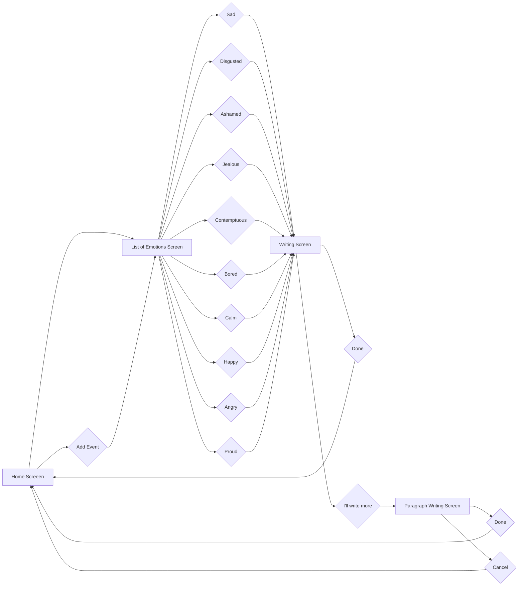

# Koyal

- UIKit
- CoreData
- A mental health app where users journal their feelings
- Keeps note of emotions as described by the user
- Editable notes shown with a simple user interface
- UITableView with custom cells

### User flow diagram of Koyal App

